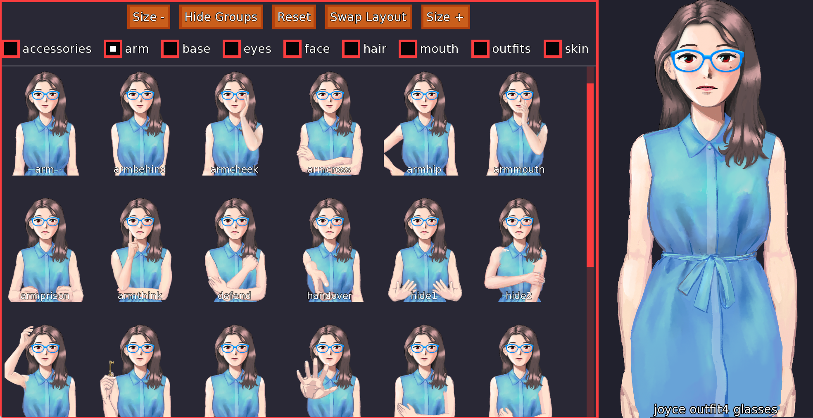
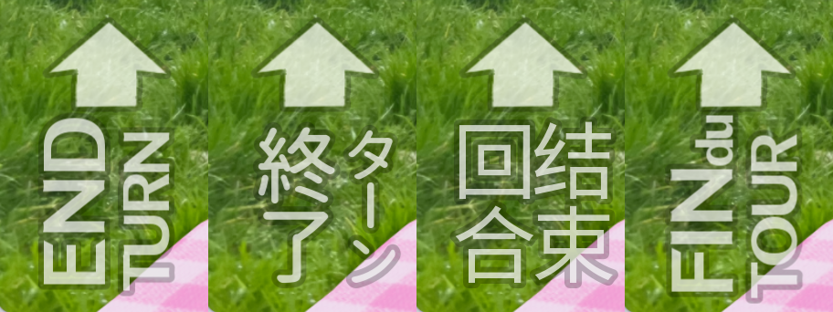

# Dating Joyce — Engine Extract

Selected systems code from **Dating Joyce**, a deckbuilding dating sim I created and released commercially as a solo developer.

Built in [Ren'Py](https://www.renpy.org/) (Python). Released on Steam, itch.io and DLsite, **2,000+ copies sold**.

> **Note on content:** 
Dating Joyce is an adult visual novel, and its [Steam page](https://store.steampowered.com/app/2832580/) is age-gated. **This repository ships no game assets or narrative script** — only the engine and interface code. Everything here is safe to read at work.

## Scale of the full project

| | |
|---|---|
| Ren'Py / Python | ~31,000 lines across 238 files |
| Script labels | 400~ |
| UI screens | 100~ |
| Art assets | 1,200~ WebP |
| Languages | English, French, Japanese, Simplified Chinese |
| Platforms | Windows, macOS, Linux, Android, Web |

## Noted features

### Card engine

https://github.com/user-attachments/assets/9253074f-6f83-43ae-a661-70e107a48e57

*The paginated deck viewer in [`src/ui/2__Screens.rpy`](src/ui/2__Screens.rpy).*

[`src/cards/2__Card_&_Deck.rpy`](src/cards/2__Card_&_Deck.rpy) and [`src/cards/3__Cards.rpy`](src/cards/3__Cards.rpy)

Cards are treated as data. Each card is one entry in `cardList`.
Playing a card will call a label with a similar name ("label_card_" + name).
Cards can have condition to be played (the `cond` field in `cardList`).
Also their effect can be defined in `cardList` directly with the `eff` field (or simple effects). Adding a card is one table entry.

`Deck` handles draw, discard and shuffle piles; `Card.updateArt()` composites each card from the illustration. It creates the card frame around it with different frame colour. Also in case of language change, the art and text are changed and rerendered.

### Layer-composited sprites

*In-engine sprite browser, filtered to the `arm` group.*

Instead of character rigging, I've drawn different face expressions, arm positions, body outfits, etc... And they are composited in a layer-style with rules.

There's 102 total attributes across 12 groups (outfit, hair, arm, expression, …), wired together by 289 conditional rules stating which parts are valid together, plus front/back
layering variants. The renderer resolves a legal composite from a tag set, so outfits × hair × poses × expressions never has to be drawn exhaustively — around 270 WebP layer assets cover a combination space far larger than itself.

### Localization

Four languages: English, French, Simplified Chinese and Japanese

- **Text has to fit fixed-size frames.** Cards have limited space for card effect descriptions, a 12-character English effect becomes a 30-character French one. `updateArt()` measures the *translated* string and scales the font down on a curve, with a separate curve for Chinese and Japanese, where glyphs are denser and the same character count needs much more room.
- **CJK support is a font-fallback problem.** Latin display faces have no CJK coverage. We need other fonts for those with [`2__Languages.rpy`](src/ui/2__Languages.rpy) rebuilding the text using the corresponding fonts.
- **Translation is content, not just strings.** Card names, effects and menu entries are translated through the same pipeline as the narrative script, so the card table stays declarative. Some text needed special treatment because of how they are stylized.
- I handled the English and French versions myself. The Chinese and Japanese ones were commissioned.

*Different ways I had to localize the button 'End Turn'*

### Multi-platform builds and editions

One tree, one codebase, five platforms and three editions.

- **Platforms:** Windows, macOS, Linux, Android and web, from the same source. Android and web
  add progressive asset download rules so the initial payload stays small.
- **Editions:** demo, censored and full SKUs produced by build classifiers, which include or exclude assets and script per build rather than maintaining branches.
- **Steamworks:** achievements with in-game notification and sync, in [`src/meta/9__Achievements.rpy`](src/meta/9__Achievements.rpy). .
